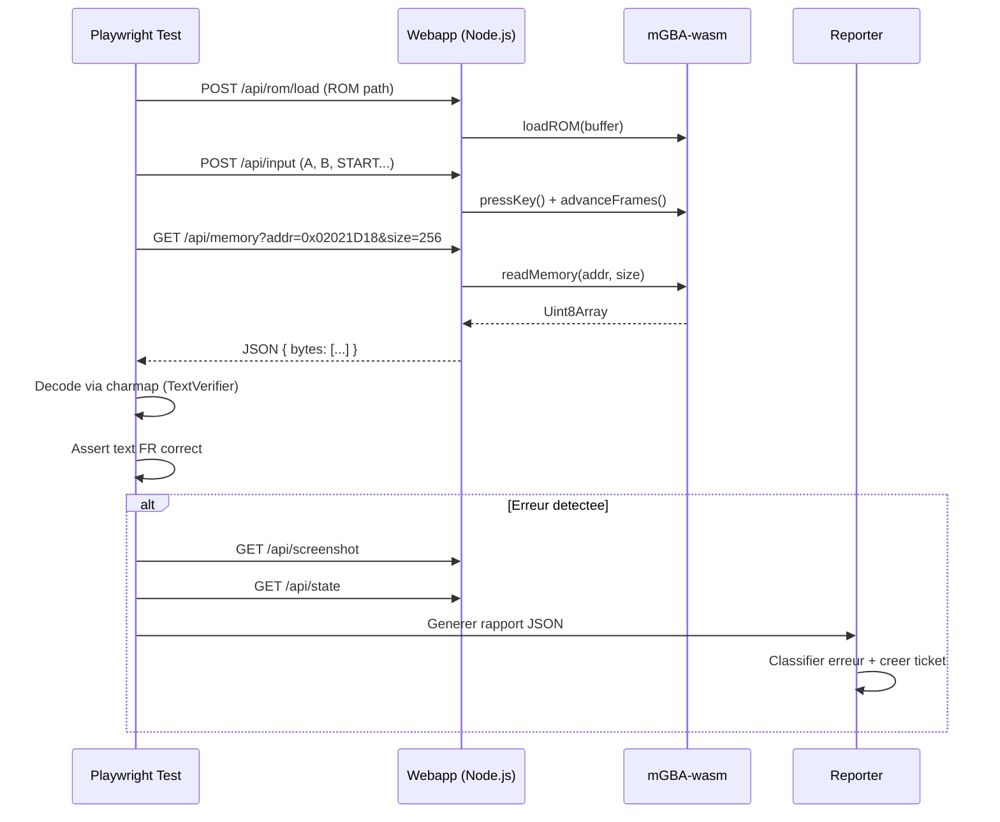

# Architecture : Systeme de test ROM live (Emulateur web + Playwright + Reporting)

> **Statut** : Specification v1.0
> **Date** : 2026-05-12
> **Scope** : Systeme complementaire au cooker mGBA/TCP existant

---

## Table des matieres

1. [Vue d'ensemble](#1-vue-densemble)
2. [Emulateur GBA Web](#2-emulateur-gba-web)
3. [Suite Playwright](#3-suite-playwright)
4. [Reporting et creation de tickets](#4-reporting-et-creation-de-tickets)
5. [Integration avec l'ecosysteme existant](#5-integration-avec-lecosysteme-existant)
6. [Risques et mitigations](#6-risques-et-mitigations)
7. [Plan de mise en oeuvre](#7-plan-de-mise-en-oeuvre)

---

## 1. Vue d'ensemble

### 1.1. Motivation

Le cooker existant (`src/cooker/`) utilise mGBA natif + bridge TCP/Lua. Il est performant mais :
- Necessite mGBA installe sur la machine (pas disponible en CI GitHub Actions standard)
- Les tests sont en Python pur, sans rendu visuel exploitable
- Pas de capture d'ecran navigateur ni de regression visuelle

Le nouveau systeme **ne remplace pas le cooker** mais le complete avec une approche navigateur :
- Execution headless en CI sans binaire natif
- Screenshots et comparaison visuelle
- Reporting structure avec creation automatique de tickets

### 1.2. Architecture globale

```
+-------------------------------------------------------------------+
|                          CI / Local                                |
|  +-------------------------------------------------------------+  |
|  |                     Playwright Test Suite                    |  |
|  |  playwright.config.ts                                        |  |
|  |  +-------------------+  +------------------+  +------------+ |  |
|  |  | GBAEmulatorPage   |  | ScenarioRunner   |  | TextVerif. | |  |
|  |  | (Page Object)     |  | (Checkpoint exec)|  | (Charmap)  | |  |
|  |  +--------+----------+  +--------+---------+  +-----+------+ |  |
|  |           |                      |                    |       |  |
|  +-----------+----------------------+--------------------+-------+  |
|              |                      |                    |         |
|  +-----------v----------------------v--------------------v-------+  |
|  |                    Webapp Emulateur                            |  |
|  |  Node.js (Express) + Static Files                             |  |
|  |  +-------------------+  +------------------+  +-------------+ |  |
|  |  | mGBA-wasm Core    |  | API REST/WS      |  | ROM Loader  | |  |
|  |  | (Emulation)       |  | /api/memory      |  | /api/rom    | |  |
|  |  |                   |  | /api/input       |  | /api/state  | |  |
|  |  +-------------------+  +------------------+  +-------------+ |  |
|  +---------------------------------------------------------------+  |
|                                                                     |
|  +---------------------------------------------------------------+  |
|  |                     Reporting Pipeline                         |  |
|  |  JSON Reports -> Classifieur -> Tickets (YAML/GitHub Issues)  |  |
|  +---------------------------------------------------------------+  |
+---------------------------------------------------------------------+
```

### 1.3. Flux de donnees



---

## 2. Emulateur GBA Web

### 2.1. Choix de l'emulateur : mGBA-wasm

| Critere               | mGBA-wasm          | gbajs2           | IodineGBA        |
|------------------------|--------------------|------------------|-------------------|
| Precision emulation    | Excellente         | Bonne            | Moyenne           |
| Acces memoire          | API C exposee      | Limité (canvas)  | Lecture seule     |
| Headless support       | Oui (Worker)       | Non              | Non               |
| Performance            | Rapide (C->WASM)   | Moyenne (JS pur) | Lente (JS pur)    |
| Fast-forward           | Natif              | Non              | Non               |
| Savestates             | Complet            | Basique          | Partiel           |
| Communaute/maintenance | Active (upstream)  | Faible           | Abandonne         |

**Recommandation : mGBA-wasm** (compilation Emscripten du vrai mGBA).

Raisons :
1. **Coherence** avec le cooker existant qui utilise deja mGBA natif -- meme core, meme precision
2. **API memoire complete** : `core.rawRead8/16/32()` expose toute la RAM/VRAM/IO
3. **Fast-forward** : `core.runFrame()` sans throttle = avance rapide programmatique
4. **Savestates** : serialize/deserialize natif via l'API C
5. **Headless** : peut tourner dans un Web Worker sans canvas

### 2.2. Structure de la webapp

```
playwright-gba/
  server/
    index.ts              # Express server principal
    routes/
      rom.ts              # POST /api/rom/load, GET /api/rom/info
      input.ts            # POST /api/input, POST /api/input/sequence
      memory.ts           # GET /api/memory, GET /api/memory/text-buffer
      state.ts            # GET /api/state, POST /api/state/save, POST /api/state/load
      control.ts          # POST /api/advance, POST /api/reset, GET /api/screenshot
    emulator/
      mgba-wrapper.ts     # Abstraction autour de mGBA-wasm
      memory-map.ts       # Adresses memoire Pokemon Unbound (miroir de emulator.py)
      charmap.ts          # Port JS du charmap Python
  public/
    index.html            # Page avec canvas (mode visuel optionnel)
    emulator.js           # mGBA-wasm loader
  wasm/
    mgba.wasm             # Binary compile
    mgba.js               # Glue Emscripten
  package.json
  tsconfig.json
```

### 2.3. APIs exposees

#### 2.3.1. ROM Management

```
POST /api/rom/load
  Body: { path: string } | multipart/form-data (fichier ROM)
  Response: { ok: true, size: number, title: string, gameCode: string }

GET /api/rom/info
  Response: { loaded: boolean, size: number, title: string, gameCode: string }
```

#### 2.3.2. Lecture memoire

```
GET /api/memory?addr=<hex>&size=<int>
  Response: { address: string, size: number, bytes: number[] }

GET /api/memory/read8?addr=<hex>
  Response: { value: number }

GET /api/memory/read16?addr=<hex>
  Response: { value: number }  // little-endian

GET /api/memory/read32?addr=<hex>
  Response: { value: number }  // little-endian

GET /api/memory/text-buffer?addr=<hex>&maxLen=<int>&encoding=pokemon
  Response: { raw: number[], decoded: string, terminatorAt: number }
```

Adresses cles (miroir de `EmulatorBridge` en Python) :

| Nom                | Adresse       | Taille | Description                         |
|--------------------|---------------|--------|-------------------------------------|
| `MAP_BANK`         | `0x02036DFC`  | 1      | Bank de la map courante             |
| `MAP_ID`           | `0x02036DFE`  | 1      | ID de la map courante               |
| `PLAYER_X`         | `0x02037078`  | 2      | Position X joueur                   |
| `PLAYER_Y`         | `0x0203707A`  | 2      | Position Y joueur                   |
| `BATTLE_FLAG`      | `0x02023E8A`  | 2      | Flag de combat actif                |
| `TEXT_FLAG`         | `0x020375C0`  | 1      | Boite de texte active               |
| `CALLBACK1`        | `0x030030F0`  | 4      | Pointeur callback1 (detection crash)|
| `TEXT_BUFFER`      | `0x02021D18`  | 256    | Buffer texte actif (par defaut)     |
| `gStringVar1`      | `0x02021D18`  | 256    | Variable texte dynamique 1          |
| `gStringVar2`      | `0x02021E18`  | 256    | Variable texte dynamique 2          |
| `gStringVar3`      | `0x02021F18`  | 256    | Variable texte dynamique 3          |
| `gStringVar4`      | `0x02022018`  | 256    | Variable texte dynamique 4          |

#### 2.3.3. Envoi d'inputs

```
POST /api/input
  Body: { key: "A"|"B"|"START"|"SELECT"|"UP"|"DOWN"|"LEFT"|"RIGHT"|"L"|"R",
          frames?: number }  // duree de la pression (defaut: 2)
  Response: { ok: true, frameCount: number }

POST /api/input/sequence
  Body: { keys: string[], gapFrames?: number }  // defaut: 4
  Response: { ok: true, frameCount: number }
```

#### 2.3.4. Controle de l'emulation

```
POST /api/advance
  Body: { frames: number }
  Response: { ok: true, frameCount: number }

POST /api/reset
  Response: { ok: true }

GET /api/screenshot
  Response: image/png (capture du framebuffer courant)

GET /api/screenshot?format=base64
  Response: { image: "data:image/png;base64,..." }
```

#### 2.3.5. Etat du jeu

```
GET /api/state
  Response: {
    frameCount: number,
    mapBank: number,
    mapId: number,
    playerX: number,
    playerY: number,
    inBattle: boolean,
    textActive: boolean,
    callback1: number,
    crashed: boolean
  }

POST /api/state/save
  Body: { slot: number }
  Response: { ok: true, slot: number }

POST /api/state/load
  Body: { slot: number }
  Response: { ok: true, slot: number, frameCount: number }

POST /api/state/export
  Response: application/octet-stream (savestate binaire)

POST /api/state/import
  Body: multipart/form-data (savestate binaire)
  Response: { ok: true }
```

### 2.4. Wrapper mGBA-wasm (`mgba-wrapper.ts`)

Le wrapper encapsule la logique d'initialisation et de controle :

```typescript
// Interface publique du wrapper
interface MGBAWrapper {
  // Lifecycle
  init(): Promise<void>;
  loadROM(buffer: Uint8Array): void;
  reset(): void;

  // Frame control
  runFrame(): void;
  advanceFrames(count: number): void;

  // Input
  pressKey(key: GBAKey, frames?: number): void;

  // Memory
  readMemory(address: number, size: number): Uint8Array;
  readU8(address: number): number;
  readU16(address: number): number;  // LE
  readU32(address: number): number;  // LE

  // State
  saveState(slot: number): void;
  loadState(slot: number): void;
  exportState(): Uint8Array;
  importState(data: Uint8Array): void;

  // Visual
  getFrameBuffer(): ImageData;
  screenshot(): Buffer;  // PNG

  // Info
  getFrameCount(): number;
  getROMInfo(): { title: string; gameCode: string; size: number };
}
```

### 2.5. Detection de crash (miroir du cooker Python)

La logique de detection de crash reproduit celle de `EmulatorBridge.detect_crash()` :

```typescript
// Callback1 coince a 0 pendant plus de 120 frames = probable crash
function detectCrash(wrapper: MGBAWrapper, lastCallback1: number, frameCount: number): boolean {
  const cb1 = wrapper.readU32(0x030030F0);
  if (cb1 === 0 && lastCallback1 === 0 && frameCount > 120) {
    return true;
  }
  return false;
}

// Retour a la map 0x0000 apres le boot = reboot non sollicite
function detectReboot(wrapper: MGBAWrapper, initialMap: number, frameCount: number): boolean {
  const bank = wrapper.readU8(0x02036DFC);
  const mapId = wrapper.readU8(0x02036DFE);
  const currentMap = (bank << 8) | mapId;
  if (currentMap === 0 && initialMap !== 0 && frameCount > 300) {
    return true;
  }
  return false;
}
```

---

## 3. Suite Playwright

### 3.1. Configuration (`playwright.config.ts`)

```typescript
// playwright.config.ts
import { defineConfig } from '@playwright/test';

export default defineConfig({
  testDir: './tests',
  timeout: 120_000,        // 2 min par test (ROM = lent)
  retries: 1,
  workers: 1,              // Sequentiel: un seul emulateur a la fois
  reporter: [
    ['html', { open: 'never' }],
    ['json', { outputFile: 'reports/playwright-results.json' }],
    ['./reporters/ticket-reporter.ts'],  // Custom reporter -> tickets
  ],
  use: {
    baseURL: 'http://localhost:3000',
    screenshot: 'only-on-failure',
    video: 'retain-on-failure',
    trace: 'retain-on-failure',
  },
  webServer: {
    command: 'npm run start:emulator',
    port: 3000,
    timeout: 30_000,
    reuseExistingServer: !process.env.CI,
  },
  projects: [
    {
      name: 'gba-tests',
      testMatch: '**/*.spec.ts',
    },
  ],
});
```

### 3.2. Structure des tests

```
playwright-gba/
  tests/
    boot/
      rom-boot.spec.ts          # Demarrage ROM, titre
      save-load.spec.ts         # Savestates fonctionnels
    menus/
      main-menu.spec.ts         # Menu principal texte FR
      pokemon-menu.spec.ts      # Menu Pokemon
      bag-menu.spec.ts          # Menu Sac
    combats/
      wild-battle.spec.ts       # Combat sauvage
      trainer-battle.spec.ts    # Combat dresseur
      battle-text.spec.ts       # Texte de combat FR
    dialogues/
      npc-dialogue.spec.ts      # Dialogues PNJ
      professor-intro.spec.ts   # Intro professeur
      long-dialogue.spec.ts     # Dialogues longs (overflow)
    exploration/
      zone-transition.spec.ts   # Changements de zone
      pokecenter.spec.ts        # Centre Pokemon
      shop.spec.ts              # Boutique
    visual/
      text-rendering.spec.ts    # Rendu visuel du texte
      overflow-detection.spec.ts # Detection debordement
    fixtures/
      emulator.fixture.ts       # Fixture Playwright
      savestates/               # Fichiers .sav pre-enregistres
        title-screen.sav
        overworld-start.sav
        before-first-battle.sav
        pokecenter.sav
    helpers/
      text-verifier.ts          # Decodage charmap + assertions
      scenario-runner.ts        # Execution de scenarios
      screenshot-comparator.ts  # Comparaison screenshots
    reporters/
      ticket-reporter.ts        # Generation de tickets
    golden/                     # Golden screenshots de reference
      boot/
      menus/
      combats/
```

### 3.3. Classes de base

#### 3.3.1. `GBAEmulatorPage` (Page Object)

```typescript
// tests/fixtures/emulator.fixture.ts
import { Page, expect } from '@playwright/test';

export class GBAEmulatorPage {
  constructor(private page: Page, private baseURL: string) {}

  async loadROM(romPath: string): Promise<void> {
    const response = await this.page.request.post(`${this.baseURL}/api/rom/load`, {
      data: { path: romPath },
    });
    expect(response.ok()).toBeTruthy();
  }

  async pressKey(key: string, frames = 2): Promise<void> {
    await this.page.request.post(`${this.baseURL}/api/input`, {
      data: { key, frames },
    });
  }

  async pressSequence(keys: string[], gapFrames = 4): Promise<void> {
    await this.page.request.post(`${this.baseURL}/api/input/sequence`, {
      data: { keys, gapFrames },
    });
  }

  async advanceFrames(count: number): Promise<void> {
    await this.page.request.post(`${this.baseURL}/api/advance`, {
      data: { frames: count },
    });
  }

  async readMemory(address: number, size: number): Promise<number[]> {
    const resp = await this.page.request.get(
      `${this.baseURL}/api/memory?addr=0x${address.toString(16)}&size=${size}`
    );
    const data = await resp.json();
    return data.bytes;
  }

  async readTextBuffer(address = 0x02021D18, maxLen = 256): Promise<string> {
    const resp = await this.page.request.get(
      `${this.baseURL}/api/memory/text-buffer?addr=0x${address.toString(16)}&maxLen=${maxLen}&encoding=pokemon`
    );
    const data = await resp.json();
    return data.decoded;
  }

  async getState(): Promise<EmulatorState> {
    const resp = await this.page.request.get(`${this.baseURL}/api/state`);
    return await resp.json();
  }

  async screenshot(): Promise<Buffer> {
    const resp = await this.page.request.get(`${this.baseURL}/api/screenshot`);
    return resp.body();
  }

  async saveState(slot: number): Promise<void> {
    await this.page.request.post(`${this.baseURL}/api/state/save`, {
      data: { slot },
    });
  }

  async loadState(slot: number): Promise<void> {
    await this.page.request.post(`${this.baseURL}/api/state/load`, {
      data: { slot },
    });
  }

  async waitForText(maxFrames = 600): Promise<string> {
    for (let f = 0; f < maxFrames; f += 10) {
      await this.advanceFrames(10);
      const state = await this.getState();
      if (state.textActive) {
        return this.readTextBuffer();
      }
    }
    return '';
  }

  async isInBattle(): Promise<boolean> {
    const state = await this.getState();
    return state.inBattle;
  }

  async detectCrash(): Promise<boolean> {
    const state = await this.getState();
    return state.crashed;
  }
}
```

#### 3.3.2. `ScenarioRunner`

Adaptateur qui execute les memes scenarios que le cooker Python, mais cote Playwright :

```typescript
// tests/helpers/scenario-runner.ts
import { GBAEmulatorPage } from '../fixtures/emulator.fixture';

interface CheckpointDef {
  name: string;
  action: (emu: GBAEmulatorPage) => Promise<CheckpointResult>;
  timeoutFrames?: number;
  required?: boolean;
}

interface CheckpointResult {
  name: string;
  status: 'passed' | 'failed' | 'timeout' | 'crash' | 'skipped';
  message: string;
  frameCount: number;
  screenshotPath?: string;
  textFound?: string;
  mapId?: number;
}

interface ScenarioDef {
  name: string;
  description: string;
  checkpoints: CheckpointDef[];
  savestateSlot?: number;
  maxTotalFrames?: number;
}

export class ScenarioRunner {
  constructor(private emu: GBAEmulatorPage) {}

  async run(scenario: ScenarioDef): Promise<ScenarioResult> {
    const results: CheckpointResult[] = [];

    if (scenario.savestateSlot !== undefined) {
      await this.emu.loadState(scenario.savestateSlot);
      await this.emu.advanceFrames(30);
    }

    for (const cp of scenario.checkpoints) {
      const result = await cp.action(this.emu);
      results.push(result);

      if (result.status === 'crash') break;
      if (result.status === 'failed' && cp.required !== false) break;

      const state = await this.emu.getState();
      if (state.frameCount > (scenario.maxTotalFrames ?? 60000)) {
        results.push({
          name: 'global_timeout',
          status: 'timeout',
          message: `Scenario exceeded ${scenario.maxTotalFrames} frames`,
          frameCount: state.frameCount,
        });
        break;
      }
    }

    return { name: scenario.name, checkpoints: results };
  }
}
```

#### 3.3.3. `TextVerifier` (integration charmap CFRU)

```typescript
// tests/helpers/text-verifier.ts

// Port du charmap Pokemon depuis src/core/text_codec.py
const POKEMON_TABLE: Record<string, number> = {
  ' ': 0x00,
  '0': 0xA1, '1': 0xA2, '2': 0xA3, '3': 0xA4, '4': 0xA5,
  '5': 0xA6, '6': 0xA7, '7': 0xA8, '8': 0xA9, '9': 0xAA,
  'A': 0xBB, 'B': 0xBC, 'C': 0xBD, 'D': 0xBE, 'E': 0xBF,
  'F': 0xC0, 'G': 0xC1, 'H': 0xC2, 'I': 0xC3, 'J': 0xC4,
  'K': 0xC5, 'L': 0xC6, 'M': 0xC7, 'N': 0xC8, 'O': 0xC9,
  'P': 0xCA, 'Q': 0xCB, 'R': 0xCC, 'S': 0xCD, 'T': 0xCE,
  'U': 0xCF, 'V': 0xD0, 'W': 0xD1, 'X': 0xD2, 'Y': 0xD3, 'Z': 0xD4,
  'a': 0xD5, 'b': 0xD6, 'c': 0xD7, 'd': 0xD8, 'e': 0xD9,
  'f': 0xDA, 'g': 0xDB, 'h': 0xDC, 'i': 0xDD, 'j': 0xDE,
  'k': 0xDF, 'l': 0xE0, 'm': 0xE1, 'n': 0xE2, 'o': 0xE3,
  'p': 0xE4, 'q': 0xE5, 'r': 0xE6, 's': 0xE7, 't': 0xE8,
  'u': 0xE9, 'v': 0xEA, 'w': 0xEB, 'x': 0xEC, 'y': 0xED, 'z': 0xEE,
  '!': 0xAB, '?': 0xAC, '.': 0xAD, '-': 0xAE, ',': 0xB8,
  "'": 0xB4, '"': 0xB0, '/': 0xBA, ':': 0xF0,
  // Accents francais
  'à': 0x16, 'ç': 0x19, 'è': 0x1A,
  'î': 0x20, 'â': 0x68, 'ù': 0x7F,
  // Accents espagnols
  'á': 0x17, 'é': 0x1B, 'í': 0x6F,
  'ó': 0x23, 'ú': 0x27, 'ñ': 0x29,
  // Pre-composed (plus courant)
  'à': 0x16, 'ç': 0x19, 'è': 0x1A,
  'î': 0x20, 'â': 0x68, 'ù': 0x7F,
  'á': 0x17, 'é': 0x1B, 'í': 0x6F,
  'ó': 0x23, 'ú': 0x27, 'ñ': 0x29,
  'À': 0x82, 'È': 0x83, 'É': 0x84,
};

const POKEMON_TERMINATOR = 0xFF;
const POKEMON_NEWLINE = 0xFE;

// Table inverse pour le decodage
const DECODE_TABLE: Record<number, string> = {};
for (const [char, byte] of Object.entries(POKEMON_TABLE)) {
  DECODE_TABLE[byte] = char;
}
DECODE_TABLE[POKEMON_NEWLINE] = '\n';

// Codes de controle multi-octets CFRU
const CONTROL_CODES: Record<number, number> = {
  0xFC: 1,  // Commande + 1 parametre (couleur, vitesse, etc.)
  0xFD: 1,  // Commande + 1 parametre (variables)
  0xF8: 1,  // Commande + 1 parametre
  0xF9: 1,  // Commande + 1 parametre
  0xF7: 2,  // Commande + 2 parametres
};

export class TextVerifier {
  /**
   * Decode un buffer memoire Pokemon en texte lisible.
   * Gere les codes de controle multi-octets CFRU.
   */
  static decode(bytes: number[]): string {
    const chars: string[] = [];
    let i = 0;
    while (i < bytes.length) {
      const b = bytes[i];
      if (b === POKEMON_TERMINATOR) break;

      // Codes de controle multi-octets
      if (b in CONTROL_CODES) {
        const skip = CONTROL_CODES[b];
        i += 1 + skip;
        continue;
      }

      if (b in DECODE_TABLE) {
        chars.push(DECODE_TABLE[b]);
      } else {
        chars.push(`[${b.toString(16).padStart(2, '0').toUpperCase()}]`);
      }
      i++;
    }
    return chars.join('');
  }

  /**
   * Encode un texte lisible en bytes Pokemon.
   */
  static encode(text: string): number[] {
    const bytes: number[] = [];
    for (const char of text) {
      if (char in POKEMON_TABLE) {
        bytes.push(POKEMON_TABLE[char]);
      }
    }
    bytes.push(POKEMON_TERMINATOR);
    return bytes;
  }

  /**
   * Verifie que le texte contient des marqueurs francais.
   * Reproduit la logique de _has_french_chars() du cooker Python.
   */
  static hasFrenchIndicators(text: string): boolean {
    const frAccents = ['é', 'è', 'ê', 'à', 'ù',
                       'ç', 'î', 'ô', 'û'];
    const frWords = ['le ', 'la ', 'les ', 'de ', 'du ', 'des ', 'un ', 'une ',
                     'est ', 'et ', 'que ', 'qui ', 'dans ', 'pour ', 'avec '];
    const lower = text.toLowerCase();
    const hasAccent = frAccents.some(a => lower.includes(a));
    const hasWord = frWords.some(w => lower.includes(w));
    return hasAccent || hasWord;
  }

  /**
   * Verifie qu'un texte ne deborde pas de la zone d'affichage GBA.
   * Limite: ~26 caracteres par ligne sur l'ecran 240px du GBA
   * avec la police Pokemon standard (largeur variable ~8px).
   */
  static checkOverflow(text: string, maxCharsPerLine = 26): string[] {
    const lines = text.split('\n');
    const overflows: string[] = [];
    for (const line of lines) {
      if (line.length > maxCharsPerLine) {
        overflows.push(line);
      }
    }
    return overflows;
  }
}
```

### 3.4. Fixture Playwright

```typescript
// tests/fixtures/emulator.fixture.ts (extension avec fixture)
import { test as base } from '@playwright/test';
import { GBAEmulatorPage } from './emulator.fixture';
import { ScenarioRunner } from '../helpers/scenario-runner';

type GBAFixtures = {
  gba: GBAEmulatorPage;
  runner: ScenarioRunner;
  romPath: string;
};

export const test = base.extend<GBAFixtures>({
  romPath: [process.env.GBA_TEST_ROM ?? 'input/roms/GenedRom-fr.gba', { option: true }],

  gba: async ({ page, baseURL }, use) => {
    const emu = new GBAEmulatorPage(page, baseURL!);
    await use(emu);
  },

  runner: async ({ gba }, use) => {
    const runner = new ScenarioRunner(gba);
    await use(runner);
  },
});

export { expect } from '@playwright/test';
```

### 3.5. Strategie de screenshots

#### Golden Files

Les screenshots de reference sont stockes dans `tests/golden/` et versiones dans git.

- **Capture** : `GET /api/screenshot` retourne le framebuffer mGBA-wasm au format PNG (240x160, palette exacte)
- **Comparaison** : Utiliser `pixelmatch` (ou `playwright-visual-comparisons`) avec un seuil de tolerance
- **Seuil** : 0.1% de pixels differents (les polices GBA sont pixel-perfect, pas d'anti-aliasing)

#### Workflow

1. **Premiere execution** : les screenshots sont sauvegardes comme golden files
2. **Executions suivantes** : comparaison pixel-a-pixel avec golden files
3. **Mise a jour** : `npx playwright test --update-snapshots` pour regenerer les golden files apres une modification voulue

#### Quand capturer

| Moment                        | Pourquoi                                      |
|-------------------------------|-----------------------------------------------|
| Ecran titre apres boot        | Verifier que le titre FR s'affiche             |
| Boite de dialogue ouverte     | Verifier le rendu du texte FR                  |
| Menu ouvert                   | Verifier les labels FR dans les menus          |
| Ecran de combat               | Verifier les noms d'attaques/Pokemon FR        |
| Apres chaque checkpoint       | Capturer l'etat pour debug en cas d'echec      |

---

## 4. Reporting et creation de tickets

### 4.1. Format de rapport JSON

Chaque execution genere un rapport structure :

```json
{
  "runId": "2026-05-12T14:30:00Z-abc123",
  "timestamp": "2026-05-12T14:30:00Z",
  "romFile": "GenedRom-fr.gba",
  "romHash": "sha256:...",
  "duration": 45.2,
  "environment": {
    "ci": true,
    "os": "ubuntu-22.04",
    "nodeVersion": "20.x",
    "playwrightVersion": "1.44.0"
  },
  "summary": {
    "total": 42,
    "passed": 38,
    "failed": 3,
    "skipped": 1,
    "crashCount": 0,
    "rebootCount": 0
  },
  "tests": [
    {
      "name": "dialogues/npc-dialogue.spec.ts > Dialogue PNJ route 1",
      "status": "failed",
      "duration": 8.5,
      "error": {
        "classification": "text_incorrect",
        "message": "Expected French text, got English",
        "expected": "Salut ! Je suis...",
        "actual": "Hi! I'm...",
        "context": {
          "mapId": "0x0312",
          "frameCount": 1842,
          "memoryAddress": "0x02021D18",
          "rawBytes": [0xCD, 0xD5, 0xE0, 0xE9, 0xE8, 0x00, ...],
          "callback1": "0x0807A3BC",
          "playerPosition": { "x": 12, "y": 8 }
        }
      },
      "screenshots": {
        "failure": "screenshots/2026-05-12/npc-dialogue-failure.png",
        "expected": "golden/dialogues/npc-route1.png"
      },
      "trace": "traces/npc-dialogue-trace.zip"
    }
  ]
}
```

### 4.2. Classification des erreurs

Le reporter classifie chaque echec selon une taxonomie :

| Classification       | Critere de detection                                    | Severite |
|----------------------|---------------------------------------------------------|----------|
| `crash`              | `callback1 == 0` pendant >120 frames, ou exception WASM | critique |
| `reboot`             | Retour map 0x0000 non sollicite                         | critique |
| `text_incorrect`     | Texte anglais detecte la ou du francais est attendu     | haute    |
| `text_overflow`      | Ligne > 26 caracteres ou debordement visuel detecte     | moyenne  |
| `missing_char`       | Octet inconnu (`[XX]`) dans le texte decode             | moyenne  |
| `visual_regression`  | Screenshot differe du golden file au-dela du seuil      | moyenne  |
| `encoding_error`     | Sequence d'octets invalide (terminateur manquant, etc.) | haute    |
| `timeout`            | Scenario depasse la limite de frames                    | basse    |

### 4.3. Systeme de creation de tickets

#### Approche hybride : fichiers locaux + GitHub Issues

**Phase 1 (locale)** : Chaque erreur genere un fichier YAML dans `tickets/` :

```yaml
# tickets/2026-05-12_text-incorrect_npc-route1.yml
id: "err-20260512-001"
classification: text_incorrect
severity: haute
title: "Texte anglais sur NPC route 1 (map 0x0312)"
description: |
  Le dialogue du PNJ sur la route 1 affiche du texte anglais
  au lieu du francais apres traduction.
context:
  test: "dialogues/npc-dialogue.spec.ts"
  map_id: "0x0312"
  memory_address: "0x02021D18"
  frame_count: 1842
  expected_text: "Salut ! Je suis..."
  actual_text: "Hi! I'm..."
  raw_bytes: [0xCD, 0xD5, 0xE0, 0xE9, 0xE8, 0x00]
  rom_hash: "sha256:..."
screenshots:
  - path: "screenshots/2026-05-12/npc-dialogue-failure.png"
    description: "Capture au moment de l'erreur"
created: "2026-05-12T14:30:00Z"
status: open
```

**Phase 2 (CI)** : Script de synchronisation `tickets/ -> GitHub Issues` :

```
scripts/sync-tickets.ts
  - Lit tous les YAML dans tickets/
  - Cree/met a jour les GitHub Issues via l'API
  - Ajoute les labels selon la classification (bug, text, visual, crash)
  - Attache les screenshots en tant que commentaires
  - Marque le YAML comme synchronise (ajoute issue_url)
```

Commande : `npx ts-node scripts/sync-tickets.ts --repo owner/gba_translator`

#### Deduplication

Avant de creer un ticket, le systeme verifie :
1. Un fichier YAML avec le meme `classification` + `map_id` + `memory_address` existe-t-il deja ?
2. Un GitHub Issue ouvert avec le meme titre existe-t-il ?
3. Si oui : ajouter un commentaire de re-occurrence plutot qu'un nouveau ticket

### 4.4. Custom Playwright Reporter

```typescript
// tests/reporters/ticket-reporter.ts
import type { Reporter, TestCase, TestResult, FullResult } from '@playwright/test/reporter';
import * as fs from 'fs';
import * as path from 'path';
import * as yaml from 'yaml';

class TicketReporter implements Reporter {
  private errors: TicketEntry[] = [];
  private ticketsDir = path.resolve('tickets');

  onBegin(): void {
    fs.mkdirSync(this.ticketsDir, { recursive: true });
  }

  onTestEnd(test: TestCase, result: TestResult): void {
    if (result.status === 'failed' || result.status === 'timedOut') {
      const entry = this.classifyError(test, result);
      this.errors.push(entry);
    }
  }

  onEnd(result: FullResult): void {
    for (const entry of this.errors) {
      const filename = `${this.dateSlug()}_${entry.classification}_${this.slugify(entry.title)}.yml`;
      const filepath = path.join(this.ticketsDir, filename);
      if (!this.isDuplicate(entry)) {
        fs.writeFileSync(filepath, yaml.stringify(entry));
      }
    }
    // Generer aussi le rapport JSON global
    this.writeGlobalReport(result);
  }

  private classifyError(test: TestCase, result: TestResult): TicketEntry {
    // Logique de classification basee sur les annotations du test
    // et le contenu des erreurs
    // ...
  }
}

export default TicketReporter;
```

---

## 5. Integration avec l'ecosysteme existant

### 5.1. Pont Python <-> JS

Le systeme Playwright est un **projet Node.js independant** (`playwright-gba/`) qui coexiste avec l'ecosysteme Python :

```
gba_translator/
  src/                     # Python existant
  tests/                   # pytest existant
  playwright-gba/          # NOUVEAU - projet Node.js
    package.json
    playwright.config.ts
    server/
    tests/
    ...
```

#### Donnees partagees (lecture seule depuis le JS)

| Donnee                  | Source Python                          | Usage JS                              |
|-------------------------|---------------------------------------|---------------------------------------|
| Charmap                 | `src/core/text_codec.py`              | Porte en TS dans `text-verifier.ts`   |
| Adresses memoire        | `src/cooker/emulator.py`              | Porte en TS dans `memory-map.ts`      |
| ROM traduite            | `output/roms/GenedRom-fr.gba`         | Chargee par l'emulateur web           |
| Traductions             | `output/translation/*_ready.json`     | Reference pour verifier le contenu    |
| Scenarios (structure)   | `src/cooker/checkpoint.py`            | Re-implementes en TS (meme logique)   |
| Savestates              | Generes par mGBA natif                | Charges via l'API web                 |

#### Script de synchronisation charmap

Pour eviter la derive entre le charmap Python et TypeScript, un script de generation automatique :

```bash
# scripts/sync-charmap.py
# Lit src/core/text_codec.py et genere playwright-gba/server/emulator/charmap.generated.ts
# Execute dans le Makefile ou en pre-commit hook
python scripts/sync-charmap.py > playwright-gba/server/emulator/charmap.generated.ts
```

Le script extrait `POKEMON_TABLE`, `SPANISH_EXTENDED_TABLE`, `FRENCH_EXTENDED_TABLE`, `ENCODE_ALIASES`, `CONTROL_CODE_ENCODE`, et les constantes (`POKEMON_TERMINATOR`, `POKEMON_NEWLINE`) pour generer un module TypeScript equivalent.

### 5.2. CI/CD : GitHub Actions

```yaml
# .github/workflows/playwright-gba.yml
name: Playwright GBA Tests

on:
  push:
    branches: [main, unbound]
    paths:
      - 'output/roms/**'
      - 'playwright-gba/**'
      - 'src/core/text_codec.py'
  pull_request:
    branches: [main, unbound]
  workflow_dispatch:

jobs:
  playwright-tests:
    runs-on: ubuntu-latest
    timeout-minutes: 30
    steps:
      - uses: actions/checkout@v4

      - uses: actions/setup-node@v4
        with:
          node-version: '20'
          cache: 'npm'
          cache-dependency-path: playwright-gba/package-lock.json

      - name: Install dependencies
        working-directory: playwright-gba
        run: npm ci

      - name: Install Playwright browsers
        working-directory: playwright-gba
        run: npx playwright install --with-deps chromium

      - name: Verify ROM exists
        run: |
          if [ ! -f output/roms/GenedRom-fr.gba ]; then
            echo "ROM not found, building..."
            make build-fr
          fi

      - name: Sync charmap
        run: python scripts/sync-charmap.py > playwright-gba/server/emulator/charmap.generated.ts

      - name: Run Playwright tests
        working-directory: playwright-gba
        run: npx playwright test
        env:
          GBA_TEST_ROM: ${{ github.workspace }}/output/roms/GenedRom-fr.gba
          CI: true

      - name: Upload test report
        if: always()
        uses: actions/upload-artifact@v4
        with:
          name: playwright-report
          path: |
            playwright-gba/playwright-report/
            playwright-gba/reports/
            playwright-gba/tickets/
            playwright-gba/test-results/

      - name: Create issues from tickets
        if: failure() && github.ref == 'refs/heads/main'
        working-directory: playwright-gba
        run: npx ts-node scripts/sync-tickets.ts --repo ${{ github.repository }}
        env:
          GITHUB_TOKEN: ${{ secrets.GITHUB_TOKEN }}
```

### 5.3. Reutilisation du cooker existant

| Composant cooker existant         | Reutilisable ? | Comment                                    |
|-----------------------------------|----------------|---------------------------------------------|
| `EmulatorBridge` (emulator.py)    | Non            | Specifique TCP/Lua mGBA natif              |
| Adresses memoire (emulator.py)    | Oui            | Portees dans `memory-map.ts`               |
| Charmap (text_codec.py)           | Oui            | Porte via `sync-charmap.py`                |
| Scenarios (checkpoint.py)         | Partiellement  | Logique portee, pas le code Python          |
| `_has_french_chars()`             | Oui            | Porte dans `TextVerifier`                  |
| Savestates mGBA                   | Oui            | Format binaire compatible mGBA-wasm         |
| Fixtures pytest (conftest.py)     | Non            | Remplacees par fixtures Playwright          |
| Tests e2e existants               | Partiellement  | Servent de spec pour les tests Playwright   |

### 5.4. Coexistence des deux systemes de test

```
make test              # pytest : unit + integration (existant)
make test-e2e          # pytest + mGBA natif : gameplay (existant)
make test-playwright   # Playwright : visual + texte navigateur (NOUVEAU)
make test-all          # Les trois suites
```

Le Makefile orchestre les deux suites. En CI :
- **Sans mGBA natif** (GitHub Actions standard) : pytest unit + Playwright
- **Avec mGBA natif** (self-hosted runner) : suite complete

---

## 6. Risques et mitigations

### 6.1. Risques techniques

| Risque                                          | Impact  | Probabilite | Mitigation                                                |
|-------------------------------------------------|---------|-------------|-----------------------------------------------------------|
| mGBA-wasm pas assez precis vs mGBA natif        | Haut    | Faible      | Meme core C, meme precision ; valider avec ROM de reference |
| Performance WASM trop lente pour fast-forward    | Moyen   | Moyen       | Limiter les scenarios a <60K frames ; utiliser savestates  |
| Charmap derive entre Python et TypeScript        | Haut    | Moyen       | Script de generation automatique + CI check                |
| Savestates mGBA natif incompatibles avec WASM    | Moyen   | Faible      | Meme version mGBA ; tester la compat au setup              |
| Faux positifs sur la detection visuelle          | Moyen   | Moyen       | Seuil de tolerance configurable ; golden files versiones   |
| ROM non disponible en CI                         | Haut    | Moyen       | ROM en artifact prive ou generee dans le workflow          |

### 6.2. Risques organisationnels

| Risque                                          | Impact  | Mitigation                                            |
|-------------------------------------------------|---------|-------------------------------------------------------|
| Double maintenance Python + TypeScript          | Moyen   | Generer le TS depuis le Python (charmap, adresses)    |
| Courbe d'apprentissage Playwright               | Faible  | Projet Python-first, Playwright est un complement     |
| Tickets dupliques / bruit                       | Moyen   | Deduplication par classification + adresse memoire     |

---

## 7. Plan de mise en oeuvre

### Phase 1 : Fondations (Semaine 1-2)
- [ ] Compiler mGBA-wasm (ou utiliser un build existant)
- [ ] Creer le serveur Node.js minimal (`playwright-gba/server/`)
- [ ] Implementer les routes API : ROM load, memory read, input, advance
- [ ] Porter le charmap en TypeScript (+ script de sync)
- [ ] Ecrire le premier test : boot ROM + verification titre

### Phase 2 : Tests de base (Semaine 3-4)
- [ ] Implementer `GBAEmulatorPage`, `ScenarioRunner`, `TextVerifier`
- [ ] Porter les 3 scenarios QUICK (boot, new_game, menu_navigation)
- [ ] Ajouter la capture de screenshots et les golden files
- [ ] Mettre en place le reporter de tickets (YAML local)

### Phase 3 : Tests avances (Semaine 5-6)
- [ ] Porter les scenarios EXTENDED (combat, pokecenter, shop, etc.)
- [ ] Ajouter la detection d'overflow visuel
- [ ] Implementer la comparaison pixel-a-pixel
- [ ] Ajouter les tests de regression de texte

### Phase 4 : CI et reporting (Semaine 7-8)
- [ ] Configurer GitHub Actions
- [ ] Implementer `sync-tickets.ts` (YAML -> GitHub Issues)
- [ ] Ajouter la deduplication de tickets
- [ ] Documenter les procedures de mise a jour des golden files

---

## ADR (Architecture Decision Records)

### ADR-001 : mGBA-wasm plutot qu'un emulateur JS pur

**Contexte** : Trois options evaluees (mGBA-wasm, gbajs2, IodineGBA).

**Decision** : mGBA-wasm.

**Raisons** :
1. Coherence avec le cooker mGBA natif existant (meme core, meme precision d'emulation)
2. API memoire complete via les bindings Emscripten (rawRead8/16/32)
3. Fast-forward sans throttle = test rapide
4. Savestates binaires compatibles entre natif et WASM
5. Projet activement maintenu (upstream mGBA)

**Consequences** :
- Necessite une etape de compilation WASM (ou recuperation d'un build pre-compile)
- Le serveur Node.js doit charger le module WASM (potentiellement ~2-5 MB)
- La precision d'emulation est identique au cooker, ce qui permet des comparaisons directes

### ADR-002 : Projet Node.js separe plutot qu'integration dans pytest

**Contexte** : Playwright peut etre pilote depuis Python (playwright-python), mais l'emulateur WASM est en JavaScript.

**Decision** : Projet Node.js independant dans `playwright-gba/`.

**Raisons** :
1. L'emulateur WASM s'integre naturellement dans un runtime Node.js/navigateur
2. Playwright + TypeScript est le choix natif et le mieux documente
3. La separation evite de coupler les dependances Python et Node.js
4. Les donnees partagees (charmap, adresses) sont synchronisees par generation de code

**Consequences** :
- Deux ecosystemes de test a maintenir (pytest + Playwright)
- Script de synchronisation charmap necessaire pour eviter la derive
- Le Makefile orchestre les deux suites

### ADR-003 : Tickets YAML locaux + sync GitHub Issues

**Contexte** : Les erreurs detectees doivent devenir des tickets traceables.

**Decision** : Fichiers YAML dans `tickets/` comme source de verite, synchronises vers GitHub Issues en CI.

**Raisons** :
1. Les fichiers YAML sont versiones dans git = traceabilite complete
2. La creation de tickets fonctionne en local (hors ligne) et en CI
3. La synchronisation GitHub Issues est optionnelle et decouplée
4. La deduplication est plus simple sur des fichiers locaux que via l'API GitHub

**Consequences** :
- Le repertoire `tickets/` doit etre dans `.gitignore` (ou versionne selon la preference)
- Le script de sync necessite un `GITHUB_TOKEN` avec les permissions `issues:write`
- Les screenshots attaches aux tickets doivent etre uploades separement
